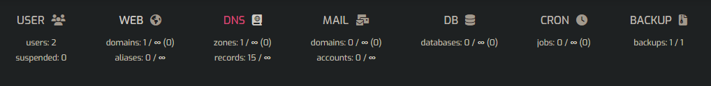
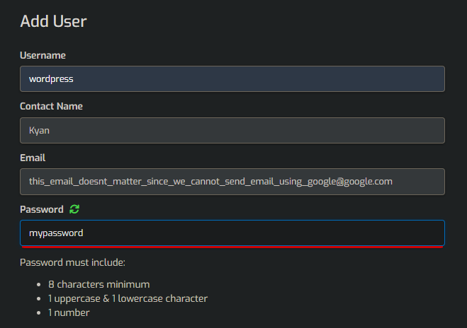
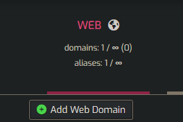
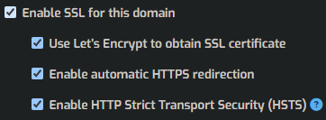

# GCP-Site

This repo is designed to utilise the free compute VM that the GCP free tier offers. Following the instructions below create a VM in which HestiaCP can be installed. The infrastructure does not implement any features that would add unnecessary cost. Some costs cannot be avoided such as Egress/Ingress data to/from the VM (assuming free tier limits are exceeded), as well as a domain name which we can purchase from NameCheap.

## Requirements
* Terraform (latest)
* Terragrunt
* Google Cloud CLI
* Namecheap-based Domain
* Ubuntu or other Linux Distro

## Note
This project uses the HestiaCP VM as DNS Nameserver. If using Namecheap, the IP of the nameservers needs to be manually set. The guide can be found [here](https://www.namecheap.com/support/knowledgebase/article.aspx/768/10/how-do-i-register-personal-nameservers-for-my-domain/). You will need to complete only up to step 5.

### WARNING
Since we are using the VM as the nameserver we cannot use Namecheap's basic DNS, rather a custom nameserver. This means you cannot specify any host records using namecheap. If you have any records here take record of them as they WILL BE OVERWRITTEN!

## Setup
0. Install [Terragrunt](https://terragrunt.gruntwork.io/docs/getting-started/install/#install-via-a-package-manager) (easiest way is through a package manager), and [terraform](https://developer.hashicorp.com/terraform/tutorials/aws-get-started/install-cli).
1. To set up the project, simply CD into the `src/infra/env/prod` directory.
2. Install the Google Cloud CLI. The easiest way is to install the tool as a snap package with the command `snap install google-cloud-cli --classic`
3. Create a Google Cloud account with an existing Google Account. You will need to add payment information.
4. Run the CLI command `gcloud init`
5. Create a new project in the Google Cloud. We need the project number of the project. This can either be done through the Web Console or by running the command `gcloud projects create [my_project_name]`. If running `gcloud init` we can create a new project from here.
6. Get the project's project ID by running the command `gcloud config get-value [my_project_name]` or from the Web Console.
7. Create a new file called `terraform.tfvars` following the `example.terraform.tfvars` file in `src/infra/env/prod` folder.
8. Set the `project_id` value to be the value gotten in step 6.
9. Enable API access for Namecheap. See the article [here](https://www.namecheap.com/support/api/intro/). Copy the api key and change the `namecheap_api_key` value to it. Change the `namecheap_user` value to be your Namecheap username and `website_domain` to be the domain you want to target.
**SEE WARNING ABOVE BEFORE CONTINUING!!!**
10. In `terragrunt.hcl` change the project value to be your project ID. *Note: That is my project ID but unless you are part of my org, it means nothing to you.*
11. Run `terragrunt init` to setup the state backend to GCP Storage. Accept any changes
12. Run `terragrunt plan` to see the proposed changes to your GCP infra.
13. Run `terragrunt apply` and optionally add the flag `--auto-approve` to skip all confirmation dialogues.
14. Once created, log into the Google Cloud Web Console, go to your project, and navigate to the VM instance: `Compute Engine > VM Instances`. The name of the VM should be **wordpress-server**. Click on SSH to open a web-based SSH client session.
15. Run `sudo su -`, then run the command `bash hcp-init-installer.sh`. This will download and setup HestiaCP to the VM. This can take up to 20 minutes to fully complete which it is not run as a startup script. The VM will restart when finished.
16. After installing, copy the external IP under Network Interfaces. Copy this into the web browser with the port number 8083 e.g. `192.168.1.1:8083`. Login with your namecheap's username (this is the default but can be changed in the startup script). The password is pushed to the Secret Manager under `heastiacp_password`. This can be found under `Security > Secret Manager` in the Console.
17. In the DNS tab, add a new DNS domain and call it `hcp.your_domain`, e.g. `hcp.mydomain.com`. Ignore the warning to add a new user since this DNS entry will be for our control panel which under the root user account. Leave settings as default, but under advanced, ensure the nameservers are `ns1.your_domain` and `ns2.your_domain`. This should be the default. When the DNS changes have propogated you can login to the HestiaCP console using `hcp.your_domain`.

18. From here, it would be best to add a new user to whom we will set up our WordPress site. Under the Users tab, add a new user and set up the credentials. If you want, you can tick `Do not allow user to log in to Control Panel, ` but to access this user, you will need to be logged into the root account. Click Save.

19. Under the user press "Log into wordpress". Press "Add Web Domain". Set the Domain to be `your_domain` e.g. `mydomain.com`. Make sure to check DNS Support. Press Save.

 

20. Press Edit Domain and, at the top right, press Quick Install App. At the bottom right, click the setup button under WordPress. This will now open a page where you can set up Wordpress credentials.
21. Edit the domain again and tick `Enable SSL for this domain`, `Use Let's Encrypt to obtain SSL certificate`, `Enable automatic HTTPS redirection` and optionally `Enable HTTP Strict Transport Security (HSTS)`. Press Save.

22. Voilla you have now created a self-hosted and (mostly) free WordPress site (assuming you followed the steps properly and the steps I outlined are correct). Grab a coffee and wait for DNS changes to propagate. To login to your to the WordPress website you the address would be `https://your_domain/wp-login.php/`.

## Licence
This is sourced under the MIT License.
